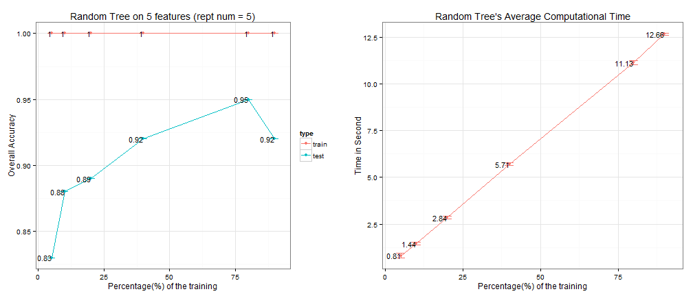

Prediction Assignment Writeup
========================================================
# Download the dataset
First, I set the working directory, load relevant pacakges and download all the datasets available on the Coursera. Then read the training and testing dataset to R.


```r
# set working directory
setwd("C:/")
if(!file.exists("./Data")) {dir.create("./Data")}
# download related training and testing dataset
train.url <- "https://d396qusza40orc.cloudfront.net/predmachlearn/pml-training.csv"
test.url <- "https://d396qusza40orc.cloudfront.net/predmachlearn/pml-testing.csv"
download.file(train.url, destfile = "./Data/train.csv")
download.file(test.url, destfile = "./Data/test.csv")
```


```r
# load relavent dataset
library(caret)
library(randomForest)
library(plyr)

# read the dataset
training <- read.csv("./Data/train.csv")
testing <- read.csv("./Data/test.csv")
```

# Dataset Cleaning
Then I noticed that there are many NAs in the dataset and many values are missing. So I decided to change the numeric values in the dataset to the type of numeric, do a count of NAs and then deleted variables with NAs over 90%. After this, 101 features are deleted because of many NAs. Finally, redo all process to the testing dataset.


```r
# feature selections
# convert all nemeric features to numeric type
training[,6:159] <- apply(training[,6:159], 2, as.numeric)

# step 1 delete the potential features with over 90% missing values
NAs <- sapply(training, function(i) sum(is.na(i))) / nrow(training)
na.feature <- names(which(NAs > 0.9))
# a short list of deleted features
head(na.feature)
```

```
## [1] "new_window"           "kurtosis_roll_belt"   "kurtosis_picth_belt" 
## [4] "kurtosis_yaw_belt"    "skewness_roll_belt"   "skewness_roll_belt.1"
```

```r
# 101 features are deleted
length(na.feature)
```

```
## [1] 101
```

```r
keep.feaure <- setdiff(names(training), na.feature)
# deleted all NA features
training <- training[,keep.feaure]

# step 2 deleted all irrelevant variables such as name, time stamp, windows..
training <- training[, 7:59]

# now perform similar treatment to testing dataset
testing <- testing[, keep.feaure[-59]]
testing <- testing[, 7:58]
```

# Sampling
I defined a sampling function that can divided the training dataset to subtrain and subtest according to porportion and number of test observations given. And this function is reproducable with a random seed defined. The function returns a list of data.frame which can be used for the cross validation part below.


```r
# function name: sample.dataset
# df <- sample.dataset(p = 0.20, tt.num = 100, dataset = training, rand.seed = 0)
# sample p% proportion of the dataset as training set
# then use sample n of the rest of the dataset as testing set

# Input>
# p         proportion of the dataset to be sampled (0.1)
# dataset   the dataset to be splited into training and testing (training)
# rand.seed the seed use for generating random sample (0)
# tt.num the number to be sampled to training dataset (100)

sample.dataset <- function(p, tt.num, dataset, rand.seed){
    set.seed(rand.seed)
    train.idx <- createDataPartition(dataset$classe, p = p , list = F)
    train <- dataset[train.idx, ]
    test.idx <- c(1:nrow(dataset))[-train.idx]
    test <- dataset[sample(test.idx, tt.num), ]
    df <- list(train = train, test = test)
    df
}
```

# Cross Validation
The overall process is:
- Select the top 5 most important features.
- Determine the size of training observations for the Random Forest.

## Use all the features
First, we sample 20% of the training dataset as train and another 200 obeservations as test. Then used all remaining 58 features to train and apply a Random Forest model. The overall accuracy is 96.5%. However, the assignment only asked us to use 5 features. So we need further features selections. 


```r
# Random Forest
# Since we already have a 20 observations testing sets, then we only use the training set to do
# a cross validation and apply a random Forest one time, and choose the best top 5 features.
df <- sample.dataset(p = 0.2, tt.num = 200, dataset = training, rand.seed = 2014)
forest <- randomForest(classe ~., data = df$train, 
                     mtry = 2, importance = TRUE, do.trace = 100)
```

```
## ntree      OOB      1      2      3      4      5
##   100:   3.72%  0.72%  5.66%  4.23%  6.68%  3.19%
##   200:   3.41%  0.90%  5.66%  3.94%  5.75%  2.35%
##   300:   3.26%  0.72%  5.39%  3.80%  5.90%  2.08%
##   400:   3.23%  0.63%  5.39%  3.80%  6.06%  1.94%
##   500:   3.16%  0.63%  5.26%  3.50%  5.90%  2.08%
```

```r
pred <- predict(forest, df$test)
acc <- table(pred, df$test$classe)
# confusion matrix
acc
```

```
##     
## pred  A  B  C  D  E
##    A 67  1  0  0  0
##    B  1 38  0  0  0
##    C  0  1 32  3  0
##    D  0  0  0 26  0
##    E  0  0  0  0 31
```

```r
# overall accuarcy 97%
sum(diag(acc)) / sum(acc)
```

```
## [1] 0.97
```

## Select features via Importance
Then we use Gini importance provided by varImp function to select the top 5 most importance values and then do another random forest with the same train and test dataset sampled by the same random seed. The overall accuracy decrease to 89%.


```r
# Then use Gini importance to select the top 5 importance features
Imp <- varImp(forest, scale = T)
# use the average Importance as a ceriteria to select features
AvgImp <- apply(Imp, 1, mean) 
top5 <- head(names(AvgImp[order(AvgImp, decreasing = T)]),5)
top5
```

```
## [1] "roll_belt"         "magnet_dumbbell_z" "yaw_belt"         
## [4] "pitch_belt"        "magnet_belt_y"
```

```r
# subset the training dataset with the top 5 features
training <- subset(training, select = c(top5, "classe"))
# have a look at the dimension
dim(training)
```

```
## [1] 19622     6
```

```r
# sample a again using the same seed and process
df <- sample.dataset(p = 0.2, tt.num = 200, dataset = training, rand.seed = 2014)
forest1 <- randomForest(classe ~., data = df$train, 
                       mtry = 2, importance = TRUE, do.trace = 100)
```

```
## ntree      OOB      1      2      3      4      5
##   100:   9.65%  7.35% 16.18% 10.95%  9.47%  5.26%
##   200:   9.37%  7.17% 15.66% 10.80%  9.16%  4.99%
##   300:   9.32%  7.35% 15.39% 10.66%  9.01%  4.99%
##   400:   9.27%  7.26% 15.66% 10.51%  8.70%  4.99%
##   500:   9.50%  7.35% 16.05% 10.95%  9.16%  4.85%
```

```r
pred1 <- predict(forest1, df$test)
acc1 <- table(pred1, df$test$classe)
# confusion matrix
acc1
```

```
##      
## pred1  A  B  C  D  E
##     A 64  5  0  2  0
##     B  1 31  1  1  0
##     C  2  1 30  3  1
##     D  0  3  1 23  0
##     E  1  0  0  0 30
```

```r
# After only use the top importance features, the overall accuarcy decreases to 89%
sum(diag(acc1)) / sum(acc1)
```

```
## [1] 0.89
```

## Define two functions to automate the process
We want to know what's the optimal training size to gain a relative accuracy result based on only 5 features. So I wrote this function to automatically do a train and prediction of Random Forest for further usage.


```r
# Now we explore the ovarall accuracy's relationship with the growing of training size
# First we aggregate our process above into a function
# This function will automatically do the sampling on the dataset with proportion given
# and sample 100 out of the train as testing for cross validation. Also we sample 100
# in the train dataset to show the in-sample-errors.

forest <- function(p, tt.num, dataset, rand.seed){
    tt <- proc.time()
    # sample data
    df <- sample.dataset(p, tt.num, dataset, rand.seed)    
        
    # train test
    ntrain <- nrow(df$train)
    if(ntrain <= 100){
        train.idx <- c(1:ntrain) 
    }else{
        train.idx <- sample(1:ntrain, 100)
    }
    
    # build tree
    tree <- randomForest(classe ~., data = df$train, 
                             mtry = 2, importance = TRUE, do.trace = 100)
    
    # predict values of the train data and accuracy
    tree.tr.pred <- predict(tree, newdata = df$train[train.idx,])
    tree.tr.accu = table(df$train[train.idx,]$classe, tree.tr.pred)
    
    # predict values of the test data and accuracy
    tree.tt.pred = predict(tree, newdata = df$test)
    tree.tt.accu = table(df$test$classe, tree.tt.pred)
    time <- round((proc.time() - tt)[3], 3)
    # return the result
    result <- list(train = tree.tr.accu, test = tree.tt.accu, time = time)
    message(paste("Time Takes", time))
    result
}
```

A plot function to visualize the optimal training size versus porportion for later usage.

```r
# now plot those accuracy to show if there is some relationship
plot.error <- function(step, rlist, title = ""){
    require(gridExtra)
    tr.acc <- sapply(rlist, function(i) sum(diag(i$train)) / sum(i$train))
    tt.acc <- sapply(rlist, function(i) sum(diag(i$test)) / sum(i$test))    
    time <- sapply(rlist, function(i) i$time)    
    
    # calculate overall accuracy
    all.tr <- data.frame(step = step, acc = tr.acc, type = "train")
    all.tt <- data.frame(step = step, acc = tt.acc, type = "test")
    all.time <- data.frame(step = step, time = time)
    all.res <- rbind(all.tr, all.tt)
    
    all.p <- ddply(all.res, .(step, type), summarize, sd = sd(acc), mean = mean(acc), se = sd(acc)/sqrt(length(acc)), count = length(acc))
    all.time.p <- ddply(all.time, .(step), summarize, sd = sd(time), mean = mean(time), se = sd(time) / sqrt(length(time)), count = length(time))
    
    p1 <- ggplot(all.p, aes(x = step*100, y = mean, colour = type, label = round(mean,2))) + 
        geom_errorbar(aes(ymin = mean - se, ymax = mean + se), width = 3, lwd = 0.7) +
        geom_line(lwd = 0.7) +
        geom_point(size = 2) +
        geom_text(size = 4, color = "black", hjust = 1) +
        theme_bw() +
        ggtitle(paste0(title, " on 5 features (rept num = ", unique(all.p$count), ")")) + 
        xlab("Percentage(%) of the training") +  
        ylab("Overall Accuracy")
    
    p2 <- ggplot(all.time.p, aes(x = step*100, y = mean, color = "red", label = round(mean,2))) + 
        geom_errorbar(aes(ymin = mean - se, ymax = mean + se), width = 3, lwd = 0.7) +
        geom_line(lwd = 0.7) +
        geom_point(size = 2) +
        geom_text(size = 4, color = "black", hjust = 1) +
        theme_bw() +
        theme(legend.position="none") +
        ggtitle(paste0(title, "'s Average Computational Time")) + 
        xlab("Percentage(%) of the training") +  
        ylab("Time in Second") 
    grid.arrange(p1, p2, ncol = 2)
    
}
```

## Overall Accuracy over Training Size

```r
# we want to try the following porportion with 5 replicates.
p <- rep(c(0.05, 0.1, 0.2, 0.4, 0.8, 0.9), 5)
# set the same seed for every porportion experiment such that they will have
# the same training and testing dataset
seed <- 2014 + rep(1:5, each = length(p))

# Now use lapply to generated the 60 confusion matrix (30 for in sample 30 for out of sample).
rlist <- lapply(1:30, function(i) forest(p = p[i], tt.num = 100, dataset = training, rand.seed = seed[i]))
```

```
## ntree      OOB      1      2      3      4      5
##   100:  16.58% 10.39% 24.21% 18.60% 20.50% 12.71%
##   200:  16.07%  9.68% 23.16% 19.77% 21.12% 10.50%
##   300:  15.87%  9.68% 24.74% 18.60% 19.88%  9.94%
##   400:  16.17%  9.68% 24.74% 20.35% 19.88%  9.94%
##   500:  16.28% 10.04% 24.21% 20.35% 19.88% 10.50%
## ntree      OOB      1      2      3      4      5
##   100:  12.83% 10.22% 18.95% 13.99% 12.73%  9.42%
##   200:  12.27%  9.14% 17.89% 14.29% 12.73%  8.86%
##   300:  11.71%  8.78% 17.37% 13.41% 12.42%  8.03%
##   400:  12.22%  8.96% 17.63% 15.45% 12.73%  8.03%
##   500:  12.32%  8.60% 17.89% 16.03% 13.04%  8.03%
## ntree      OOB      1      2      3      4      5
##   100:  10.24%  7.71% 15.92% 13.72%  8.85%  6.09%
##   200:   9.65%  7.08% 15.39% 12.85%  8.54%  5.54%
##   300:   9.50%  6.72% 15.00% 13.28%  8.07%  5.68%
##   400:   9.50%  7.08% 15.39% 12.26%  8.23%  5.54%
##   500:   9.63%  7.26% 15.39% 12.70%  8.70%  5.12%
## ntree      OOB      1      2      3      4      5
##   100:   7.18%  5.20% 11.26% 10.01%  6.92%  3.53%
##   200:   7.25%  5.06% 10.86% 10.74%  6.92%  3.81%
##   300:   7.15%  4.84% 10.86% 10.59%  6.84%  3.81%
##   400:   7.04%  4.75% 11.13% 10.01%  6.68%  3.81%
##   500:   7.03%  4.93% 10.80% 10.01%  6.76%  3.74%
## ntree      OOB      1      2      3      4      5
##   100:   5.60%  4.10%  8.66%  7.78%  5.32%  2.88%
##   200:   5.40%  4.08%  8.49%  7.41%  4.78%  2.84%
##   300:   5.41%  4.12%  8.59%  7.20%  5.01%  2.74%
##   400:   5.32%  4.14%  8.46%  7.16%  4.74%  2.60%
##   500:   5.31%  3.97%  8.49%  6.98%  5.05%  2.70%
## ntree      OOB      1      2      3      4      5
##   100:   5.24%  4.20%  8.07%  6.95%  4.91%  2.53%
##   200:   5.08%  4.02%  7.87%  7.01%  4.56%  2.40%
##   300:   5.03%  4.02%  7.78%  6.82%  4.56%  2.43%
##   400:   5.07%  4.14%  7.81%  6.88%  4.56%  2.37%
##   500:   5.07%  4.08%  7.72%  6.88%  4.63%  2.46%
## ntree      OOB      1      2      3      4      5
##   100:  16.58% 10.39% 24.21% 18.60% 20.50% 12.71%
##   200:  16.07%  9.68% 23.16% 19.77% 21.12% 10.50%
##   300:  15.87%  9.68% 24.74% 18.60% 19.88%  9.94%
##   400:  16.17%  9.68% 24.74% 20.35% 19.88%  9.94%
##   500:  16.28% 10.04% 24.21% 20.35% 19.88% 10.50%
## ntree      OOB      1      2      3      4      5
##   100:  12.83% 10.22% 18.95% 13.99% 12.73%  9.42%
##   200:  12.27%  9.14% 17.89% 14.29% 12.73%  8.86%
##   300:  11.71%  8.78% 17.37% 13.41% 12.42%  8.03%
##   400:  12.22%  8.96% 17.63% 15.45% 12.73%  8.03%
##   500:  12.32%  8.60% 17.89% 16.03% 13.04%  8.03%
## ntree      OOB      1      2      3      4      5
##   100:  10.24%  7.71% 15.92% 13.72%  8.85%  6.09%
##   200:   9.65%  7.08% 15.39% 12.85%  8.54%  5.54%
##   300:   9.50%  6.72% 15.00% 13.28%  8.07%  5.68%
##   400:   9.50%  7.08% 15.39% 12.26%  8.23%  5.54%
##   500:   9.63%  7.26% 15.39% 12.70%  8.70%  5.12%
## ntree      OOB      1      2      3      4      5
##   100:   7.18%  5.20% 11.26% 10.01%  6.92%  3.53%
##   200:   7.25%  5.06% 10.86% 10.74%  6.92%  3.81%
##   300:   7.15%  4.84% 10.86% 10.59%  6.84%  3.81%
##   400:   7.04%  4.75% 11.13% 10.01%  6.68%  3.81%
##   500:   7.03%  4.93% 10.80% 10.01%  6.76%  3.74%
## ntree      OOB      1      2      3      4      5
##   100:   5.60%  4.10%  8.66%  7.78%  5.32%  2.88%
##   200:   5.40%  4.08%  8.49%  7.41%  4.78%  2.84%
##   300:   5.41%  4.12%  8.59%  7.20%  5.01%  2.74%
##   400:   5.32%  4.14%  8.46%  7.16%  4.74%  2.60%
##   500:   5.31%  3.97%  8.49%  6.98%  5.05%  2.70%
## ntree      OOB      1      2      3      4      5
##   100:   5.24%  4.20%  8.07%  6.95%  4.91%  2.53%
##   200:   5.08%  4.02%  7.87%  7.01%  4.56%  2.40%
##   300:   5.03%  4.02%  7.78%  6.82%  4.56%  2.43%
##   400:   5.07%  4.14%  7.81%  6.88%  4.56%  2.37%
##   500:   5.07%  4.08%  7.72%  6.88%  4.63%  2.46%
## ntree      OOB      1      2      3      4      5
##   100:  16.58% 10.39% 24.21% 18.60% 20.50% 12.71%
##   200:  16.07%  9.68% 23.16% 19.77% 21.12% 10.50%
##   300:  15.87%  9.68% 24.74% 18.60% 19.88%  9.94%
##   400:  16.17%  9.68% 24.74% 20.35% 19.88%  9.94%
##   500:  16.28% 10.04% 24.21% 20.35% 19.88% 10.50%
## ntree      OOB      1      2      3      4      5
##   100:  12.83% 10.22% 18.95% 13.99% 12.73%  9.42%
##   200:  12.27%  9.14% 17.89% 14.29% 12.73%  8.86%
##   300:  11.71%  8.78% 17.37% 13.41% 12.42%  8.03%
##   400:  12.22%  8.96% 17.63% 15.45% 12.73%  8.03%
##   500:  12.32%  8.60% 17.89% 16.03% 13.04%  8.03%
## ntree      OOB      1      2      3      4      5
##   100:  10.24%  7.71% 15.92% 13.72%  8.85%  6.09%
##   200:   9.65%  7.08% 15.39% 12.85%  8.54%  5.54%
##   300:   9.50%  6.72% 15.00% 13.28%  8.07%  5.68%
##   400:   9.50%  7.08% 15.39% 12.26%  8.23%  5.54%
##   500:   9.63%  7.26% 15.39% 12.70%  8.70%  5.12%
## ntree      OOB      1      2      3      4      5
##   100:   7.18%  5.20% 11.26% 10.01%  6.92%  3.53%
##   200:   7.25%  5.06% 10.86% 10.74%  6.92%  3.81%
##   300:   7.15%  4.84% 10.86% 10.59%  6.84%  3.81%
##   400:   7.04%  4.75% 11.13% 10.01%  6.68%  3.81%
##   500:   7.03%  4.93% 10.80% 10.01%  6.76%  3.74%
## ntree      OOB      1      2      3      4      5
##   100:   5.60%  4.10%  8.66%  7.78%  5.32%  2.88%
##   200:   5.40%  4.08%  8.49%  7.41%  4.78%  2.84%
##   300:   5.41%  4.12%  8.59%  7.20%  5.01%  2.74%
##   400:   5.32%  4.14%  8.46%  7.16%  4.74%  2.60%
##   500:   5.31%  3.97%  8.49%  6.98%  5.05%  2.70%
## ntree      OOB      1      2      3      4      5
##   100:   5.24%  4.20%  8.07%  6.95%  4.91%  2.53%
##   200:   5.08%  4.02%  7.87%  7.01%  4.56%  2.40%
##   300:   5.03%  4.02%  7.78%  6.82%  4.56%  2.43%
##   400:   5.07%  4.14%  7.81%  6.88%  4.56%  2.37%
##   500:   5.07%  4.08%  7.72%  6.88%  4.63%  2.46%
## ntree      OOB      1      2      3      4      5
##   100:  16.58% 10.39% 24.21% 18.60% 20.50% 12.71%
##   200:  16.07%  9.68% 23.16% 19.77% 21.12% 10.50%
##   300:  15.87%  9.68% 24.74% 18.60% 19.88%  9.94%
##   400:  16.17%  9.68% 24.74% 20.35% 19.88%  9.94%
##   500:  16.28% 10.04% 24.21% 20.35% 19.88% 10.50%
## ntree      OOB      1      2      3      4      5
##   100:  12.83% 10.22% 18.95% 13.99% 12.73%  9.42%
##   200:  12.27%  9.14% 17.89% 14.29% 12.73%  8.86%
##   300:  11.71%  8.78% 17.37% 13.41% 12.42%  8.03%
##   400:  12.22%  8.96% 17.63% 15.45% 12.73%  8.03%
##   500:  12.32%  8.60% 17.89% 16.03% 13.04%  8.03%
## ntree      OOB      1      2      3      4      5
##   100:  10.24%  7.71% 15.92% 13.72%  8.85%  6.09%
##   200:   9.65%  7.08% 15.39% 12.85%  8.54%  5.54%
##   300:   9.50%  6.72% 15.00% 13.28%  8.07%  5.68%
##   400:   9.50%  7.08% 15.39% 12.26%  8.23%  5.54%
##   500:   9.63%  7.26% 15.39% 12.70%  8.70%  5.12%
## ntree      OOB      1      2      3      4      5
##   100:   7.18%  5.20% 11.26% 10.01%  6.92%  3.53%
##   200:   7.25%  5.06% 10.86% 10.74%  6.92%  3.81%
##   300:   7.15%  4.84% 10.86% 10.59%  6.84%  3.81%
##   400:   7.04%  4.75% 11.13% 10.01%  6.68%  3.81%
##   500:   7.03%  4.93% 10.80% 10.01%  6.76%  3.74%
## ntree      OOB      1      2      3      4      5
##   100:   5.60%  4.10%  8.66%  7.78%  5.32%  2.88%
##   200:   5.40%  4.08%  8.49%  7.41%  4.78%  2.84%
##   300:   5.41%  4.12%  8.59%  7.20%  5.01%  2.74%
##   400:   5.32%  4.14%  8.46%  7.16%  4.74%  2.60%
##   500:   5.31%  3.97%  8.49%  6.98%  5.05%  2.70%
## ntree      OOB      1      2      3      4      5
##   100:   5.24%  4.20%  8.07%  6.95%  4.91%  2.53%
##   200:   5.08%  4.02%  7.87%  7.01%  4.56%  2.40%
##   300:   5.03%  4.02%  7.78%  6.82%  4.56%  2.43%
##   400:   5.07%  4.14%  7.81%  6.88%  4.56%  2.37%
##   500:   5.07%  4.08%  7.72%  6.88%  4.63%  2.46%
## ntree      OOB      1      2      3      4      5
##   100:  16.58% 10.39% 24.21% 18.60% 20.50% 12.71%
##   200:  16.07%  9.68% 23.16% 19.77% 21.12% 10.50%
##   300:  15.87%  9.68% 24.74% 18.60% 19.88%  9.94%
##   400:  16.17%  9.68% 24.74% 20.35% 19.88%  9.94%
##   500:  16.28% 10.04% 24.21% 20.35% 19.88% 10.50%
## ntree      OOB      1      2      3      4      5
##   100:  12.83% 10.22% 18.95% 13.99% 12.73%  9.42%
##   200:  12.27%  9.14% 17.89% 14.29% 12.73%  8.86%
##   300:  11.71%  8.78% 17.37% 13.41% 12.42%  8.03%
##   400:  12.22%  8.96% 17.63% 15.45% 12.73%  8.03%
##   500:  12.32%  8.60% 17.89% 16.03% 13.04%  8.03%
## ntree      OOB      1      2      3      4      5
##   100:  10.24%  7.71% 15.92% 13.72%  8.85%  6.09%
##   200:   9.65%  7.08% 15.39% 12.85%  8.54%  5.54%
##   300:   9.50%  6.72% 15.00% 13.28%  8.07%  5.68%
##   400:   9.50%  7.08% 15.39% 12.26%  8.23%  5.54%
##   500:   9.63%  7.26% 15.39% 12.70%  8.70%  5.12%
## ntree      OOB      1      2      3      4      5
##   100:   7.18%  5.20% 11.26% 10.01%  6.92%  3.53%
##   200:   7.25%  5.06% 10.86% 10.74%  6.92%  3.81%
##   300:   7.15%  4.84% 10.86% 10.59%  6.84%  3.81%
##   400:   7.04%  4.75% 11.13% 10.01%  6.68%  3.81%
##   500:   7.03%  4.93% 10.80% 10.01%  6.76%  3.74%
## ntree      OOB      1      2      3      4      5
##   100:   5.60%  4.10%  8.66%  7.78%  5.32%  2.88%
##   200:   5.40%  4.08%  8.49%  7.41%  4.78%  2.84%
##   300:   5.41%  4.12%  8.59%  7.20%  5.01%  2.74%
##   400:   5.32%  4.14%  8.46%  7.16%  4.74%  2.60%
##   500:   5.31%  3.97%  8.49%  6.98%  5.05%  2.70%
## ntree      OOB      1      2      3      4      5
##   100:   5.24%  4.20%  8.07%  6.95%  4.91%  2.53%
##   200:   5.08%  4.02%  7.87%  7.01%  4.56%  2.40%
##   300:   5.03%  4.02%  7.78%  6.82%  4.56%  2.43%
##   400:   5.07%  4.14%  7.81%  6.88%  4.56%  2.37%
##   500:   5.07%  4.08%  7.72%  6.88%  4.63%  2.46%
```

# Conclusion
After building 30 random forest, we already know that:
- The training time is almost in a positive linear relationship with the training size.
- The random forest is quiet robust with little variations with different training sample (please see the length ofthe error bars).
- The in sample error is considerably smaller than the out of sample error.
- The optimal training size is around 80% of the training observation. So we can use this as a training size to do a relatively accuracy prediction on the testing dataset.

```r
plot.error(p, rlist, "Random Tree")
```



Using the 5 features and 80% of training observation selected by the cross validation section, I apply my best model on the 20 testing observation and compare it with the ground truth, My result is 20 out of 20.
